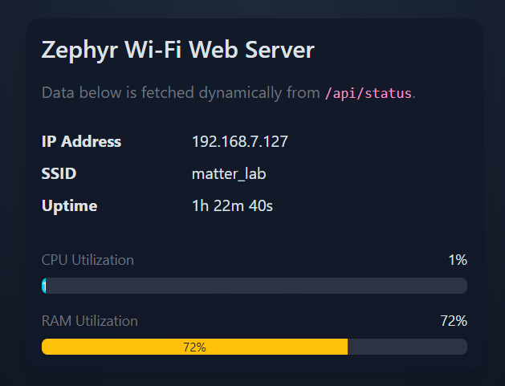

# dynamic_web

## Purpose
Zephyr app that:
- connects to Wi-Fi using credentials in `src/wifi_secrets.h` (git-ignored),
- gets IPv4 via DHCP,
- runs an HTTP server,
- serves a Bootstrap 5.3 web UI,
- exposes runtime status (`IP`, `SSID`, `uptime`, `CPU%`, `RAM%`).



## Environment
| Tool                 | Version |  
| --------             | ------- |
| Zephyr               | 4.3.0 |
| Zephyr SDK           | zephyr-sdk-0.17.4 |
| VS Code              | 1.112.0 |
| Workbench for Zephyr | 2.6.2 |

## Hardware
M5 Stack Core2.

## Project Layout
- `src/main.c`: app orchestration.
- `src/wifi_service.c`: Wi-Fi connect/reconnect and DHCP readiness.
- `src/filesystem_service.c`: LittleFS mount/format and web asset sync.
- `src/webserver_service.c`: HTTP resources and `/api/status`.
- `src/app_utils.c`: CPU and RAM utilization helpers.
- `src/wifi_secrets.h`: local Wi-Fi credentials (not tracked).
- `src/wifi_secrets.h.example`: credentials template.
- `boards/`: optional board-specific overlays/configuration.
- `web/`: editable website source files.
- `web/vendor/bootstrap/`: compiled Bootstrap assets.

## Configure Wi-Fi Secrets
Edit `src/wifi_secrets.h`:

```c
#define WIFI_SSID "YOUR_WIFI_SSID"
#define WIFI_PSK  "YOUR_WIFI_PASSWORD"
```

## Build and Flash
From this directory:

```sh
west build -b <board> -p auto
west flash
```

Pick a Wi-Fi-capable board/SoC target and matching overlay/config.

## Web Content Source Modes
Configured in `Kconfig` (`APP_WEB_CONTENT_SOURCE` choice):

- `CONFIG_APP_WEB_CONTENT_FROM_FILESYSTEM=y`
  - Server reads files from `/lfs/www` (LittleFS `storage_partition`).
  - Optional boot sync from embedded assets:
    - `CONFIG_APP_SYNC_WEB_FILES_ON_BOOT=y` (overwrite on boot)
    - `CONFIG_APP_SYNC_WEB_FILES_ON_BOOT=n` (preserve files changed externally)

- `CONFIG_APP_WEB_CONTENT_FROM_FIRMWARE=y`
  - Server serves static files directly from firmware image.
  - No LittleFS mount/sync required for website serving.

Current `prj.conf` is set to filesystem mode.

## Compression and Storage Notes
- Bootstrap vendor assets are embedded as gzip and served with gzip encoding.
- In filesystem mode, files are written under `/lfs/www/vendor/bootstrap/...`.

## MCUmgr File Updates
- Filesystem management over MCUmgr is enabled with:
  - `CONFIG_MCUMGR_GRP_FS=y`
  - `CONFIG_MCUMGR_TRANSPORT_SHELL=y`
- Current shell transport tuning in `prj.conf`:
  - `CONFIG_MCUMGR_TRANSPORT_NETBUF_COUNT=8`
  - `CONFIG_MCUMGR_TRANSPORT_NETBUF_SIZE=1024`
  - `CONFIG_MCUMGR_TRANSPORT_SHELL_MTU=512`
  - `CONFIG_MCUMGR_TRANSPORT_SHELL_RX_BUF_COUNT=4`
  - `CONFIG_MCUMGR_TRANSPORT_SHELL_INPUT_TIMEOUT=y`
  - `CONFIG_MCUMGR_TRANSPORT_SHELL_INPUT_TIMEOUT_TIME=10000`
  - `CONFIG_MCUMGR_TRANSPORT_WORKQUEUE_STACK_SIZE=3072`
- [AuTerm](https://github.com/thedjnK/AuTerm/) on Windows 11 was used to test MCUmgr functionality and option to download and upload files from filesystem.

## Exposed Routes
- `/` -> main page
- `/styles.css`, `/app.js`
- `/vendor/bootstrap/css/bootstrap.min.css`
- `/vendor/bootstrap/js/bootstrap.bundle.min.js`
- `/api/status` -> JSON:
  - `uptime_ms`
  - `ip`
  - `ssid`
  - `cpu_load_percent`
  - `ram_util_percent`
