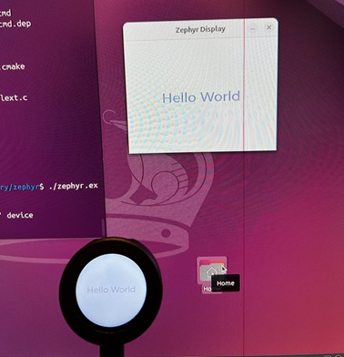

# lvgl_hello_world

## Purpose
Demonstrate LVGL usage in Zephyr on a touch display. The demo shows a "Hello World"
label with a fade-in/out animation and randomizes the text color on touch.



## Environment
| Tool                 | Version |
| --------             | ------- |
| Zephyr               | 4.3.0 |
| Zephyr SDK           | zephyr-sdk-0.17.4 |
| VS Code              | 1.108.2 |
| Workbench for Zephyr | 2.2.1 |

## Hardware
ESP32-S3 Development Board with 1.28" Round Touch LCD (Waveshare).

## Project Layout
- `src/main.c`: LVGL demo app with animation and touch handler.
- `prj.conf`: Zephyr and LVGL configuration.
- `boards/`: Board overlays or board-specific settings (if present).

## Build and Flash
From this directory, replace `<board>` with your target (example: `esp32s3_devkitc`).

```sh
west build -b <board> -p auto
west flash
```

## Run Behavior
- The label fades in/out continuously.
- Touching the screen changes the label's text color.

## Configuration Notes
- Fonts are enabled in `prj.conf`. The demo uses `lv_font_montserrat_28`.
- LVGL label and animation settings are in `src/main.c`.

## Simulation
- Validated on Linux (Ubuntu 24.04.3 Desktop).
- Enable following options in `prj.conf`
    ```
    CONFIG_INPUT=y
    CONFIG_INPUT_SDL_TOUCH=y
    ```
- Build the sample for native simulator using `native_sim/native/64` as a build target.
    ```sh
    west build -b native_sim/native/64 -p auto
    ```
- Run zephyr.exe
    ```sh
    ./zephyr.exe
    ```  
- Screen pops up and reacts to user touch input, i.e. mouse click.

## Troubleshooting
- If the screen stays blank, confirm your display driver and board overlays.
- If touch does not work, verify the touch controller device tree bindings.
